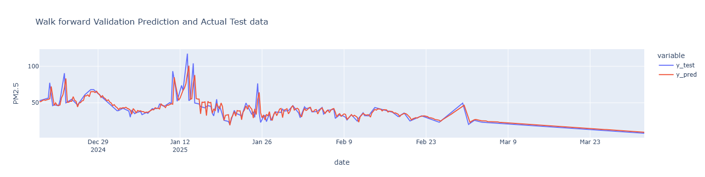
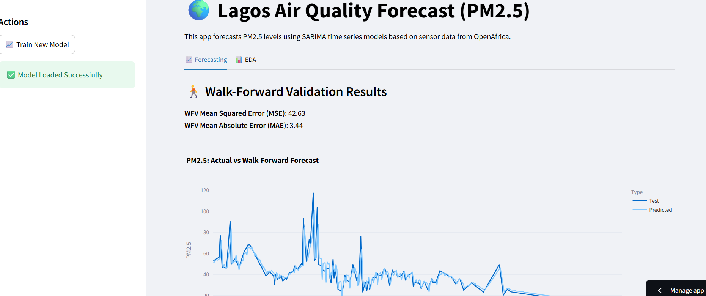

# Air Quality Prediction in Lagos


This project focuses on forecasting air quality in Lagos, Nigeria, by predicting PM2.5 levels using time series modeling techniques — primarily SARIMA. It includes full preprocessing, model training, evaluation, and walk-forward validation pipelines. The data source is Sensor Africa, accessed via OpenAfrica.

---

## 📁 Project Structure
```
├── config.yaml                  # Central configuration file
├── requirements.txt             # Project dependencies
├── README.md                    # Project documentation
├── main.py                      # Run entire Pipeline on terminal
├── app.py                       # Deploy App on Dreamlit
│
├── data/
│   ├── monthly\_record/          # Raw monthly CSVs from Sensor Africa
│   └── combined\_dataset.csv     # Merged and resampled dataset
│
├── images/                       # plots, background images, and other images
├── models/                      # Trained SARIMA models (.pkl files)
├── results/                     # Evaluation results, model summaries, WFV CSVs
├── notebooks/
│   ├── exploratory.ipynb        # Exploratory data analysis
│   ├── combine\_dataset.ipynb    # Dataset merging and cleaning
│   └── models.ipynb             # Model experimentation
│
├── scripts/
│   ├── config.py                # Load YAML configuration
│   ├── wrangle.py               # Data loading, cleaning, merging
│   ├── model\_training.py        # SARIMA training, saving, forecasting
│   ├── evaluate.py              # Evaluation metrics and visualizations
│   └── validate.py              # Walk-forward validation framework 
```

---

## 🔍 Project Objectives

- Clean and consolidate hourly air quality readings
- Resample and interpolate missing data
- Train and validate SARIMA models
- Save model artifacts and summaries
- Evaluate model predictions using:
  - Mean Absolute Error (MAE)
  - Mean Squared Error (MSE)
- Perform walk-forward validation
- Deployment of app with interactive dashboard

---

## Exploratory Data Analysis
- Monthly data were combined into a single csv file through the wrangle script [check here](scripts/wrangle.py)
- The dataset contains PM2.5 values between `November 2023` and `April 2025`
- The PM2.5 readings were sampled into 6 hours intervals for smoothiness.
- Interpolation was applied to handle missing data.
- The 30 days rolling Average showed a trend of very poor air quality in the beginning and end of the years considered.
- Most of the PM2.5 readings in Lagos falls between ```20 and 45```
- There was also a Daily and weekly trend as confirmed by decomposition plot and ACF plot.
- The data is non-stationary and it contains seasonality which makes SARIMA a best option for model building.
- Check the Exploratory Data Analysis notebook for more details [here](notebooks/combine_dataset.ipynb)

---

## Model Building
### Baseline Model
- A baseline model was set up to determine if a model is underperforming or not. This model predicts only the mean values,
  here is an example:
  ```
  # Baseline Model Metrics
  mean = train.mean()
  y_mean_pred = len(train) * [mean]
  
  # MSE and MAE of the Baseline model
  mse_baseline = mean_squared_error(train, y_mean_pred)
  mae_baseline = mean_absolute_error(train, y_mean_pred)
   ```
- Baseline Model **MSE: 481.99**  |  **MAE: 15.79**

### SARIMA model
- Hyperparameter tuning using auto_arima obtained **order** of (3,1,1) and **seasonal_order** of (2,0,2, 4)
- SARIMA Model with Walk-forward Validation had **MSE: 42.63**  |  **MAE: 3.44**

---
## ⚙️ Configuration

All project parameters (file paths, SARIMA settings, etc.) are managed in a central `config.yaml` file.

Here:
```yaml
data:
  monthly_data_folder: "data/monthly_p2_readings/"
  combined_output_csv: "data/Air_Quality_Lagos_Combined.csv"
  resample_freq: "6H"

model:
  type: "SARIMA"
  order: [3, 1, 1]
  seasonal_order: [2, 0, 2, 4]
  seasonal_period: 4

paths:
  results_folder: "results/"
  models_folder: "models/"
  combined_csv: "data/Air_Quality_Lagos_Combined.csv"

validation:
  test_start_date: "2024-11-25"

````

---

## Deployment to Streamlit
- The deployment script is found in [app.py](app.py)
- Interact with the deployed app [here](https://air-quality-prediction-in-lagos-app.streamlit.app/)



---

## 🧪 How to Run

### 1. Install dependencies

```bash
pip install -r requirements.txt
```

### 2. Merge & preprocess data

```bash
python scripts/wrangle.py
```

### 3. Train and save a SARIMA model

```bash
python scripts/model_training.py
```

### 4. Walk-forward validation

```bash
python scripts/validate.py
```

---

## 📈 Example Output

* `models/`: Timestamped `.pkl` files of trained SARIMA models
* `results/`:

  * Model summaries (text)
  * WFV results (CSV)
  * Evaluation metrics printed to console

---

## 📚 Dependencies

* Python 3.10+
* pandas
* numpy
* scikit-learn
* statsmodels
* joblib
* plotly
* pyyaml

See [`requirements.txt`](requirements.txt) for exact versions.

---

## 📌 Data Source

Sensor Africa (via [OpenAfrica.net](https://open.africa/dataset/sensorsafrica-airquality-archive-lagos))


